<a name="top"></a>
# Setting up an On-Prem System

## Navigation

| Back |
|---|
|[Exercise 4 - Order New Items](../Exercise-04-Order-New-Items) |


## Table of Contents
- [Setting up an On-Prem System](#setting-up-an-on-prem-system)
  - [Navigation](#navigation)
  - [Table of Contents](#table-of-contents)
- [Pre-requisites](#pre-requisites)
- [1. Deploy Product Backend OData Service](#1-deploy-product-backend-odata-service)
- [2. Start the SAP Cloud Connector](#2-start-the-sap-cloud-connector)
- [3. Configure the SAP Cloud Connector](#3-configure-the-sap-cloud-connector)

# Pre-requisites
1. Download the tomcat file by [clicking here](https://github.com/sandeep-tds/cloud-cf-furnitureshop-documentation/raw/master/Exercise-04-Order-New-Items/apache-tomcat-9.0.11_OPP363.zip) and extract it.
2. Download the Cloud Connector for your machine using the following links and extract the file.
   * [Windows](https://tools.hana.ondemand.com/additional/sapcc-2.11.3-windows-x64.zip)
   * [Mac](https://tools.hana.ondemand.com/additional/sapcc-2.11.3-macosx-x64.tar.gz)

<a name="Step1"></a>
# 1. Deploy Product Backend OData Service

1. Open your terminal / command prompt change the active directory to your tomcat folder.
2. Enter the `bin` folder.
3. Start the Tomcat server by using the following commands:
    * Windows
        ```shell
        startup.bat
        ```
    * Mac
        ```
        sh startup.sh
        ```
4. The OData service provided by this local Tomcat server can be viewed at this URL <http://localhost:8080/backend-odata/Product.svc>.

    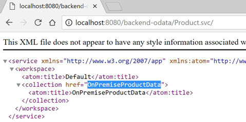

    Notice that the OData service exposes a collection called `OnPremiseProductData`.

5. Append `/OnPremiseProductData` to the URL and press enter, or click on this link <http://localhost:8080/backend-odata/Product.svc/OnPremiseProductData>.

    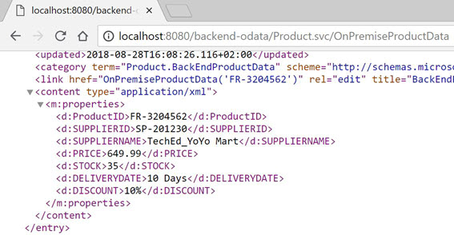

    Now you can see the additional product information provided by this little server.

[Top](#top)

<a name="Step2"></a>
# 2. Start the SAP Cloud Connector

The Cloud Connector is an optional on-premise component that integrates applications running on the SAP Cloud Platform with customer services running in on-premise systems.  It is the counterpart of SAP Cloud Platform Connectivity.

1. Open your terminal / command prompt change the active directory to your SAP Cloud Connector folder.
2. Start the Tomcat server by using the following commands:
    * Windows
        ```shell
        go.bat
        ```
    * Mac
        ```
        sh go.sh
        ```
3. On waiting a few seconds you will see the following message in your terminal window. Once you see this message, you can proceed to the subsequent steps.

   ```shell
   Cloud Connector 2.11.3 started on https://localhost:8443 (master)
   ```

<a name="Step3"></a>
# 3. Configure the SAP Cloud Connector

1. Before we can configure the SAP Cloud Connector, we need to get our Subaccount ID.

2. Login to the SAP Cloud Platform cockpit [TechEd 2018](https://account.hana.ondemand.com/cockpit#/globalaccount/8fd39023-a237-4d71-9b6a-ed9d1719d275/subaccounts)

3. Click the 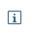 icon in the bottom left corner of the Cloud Foundry subaccount tile (OPP363CF).

    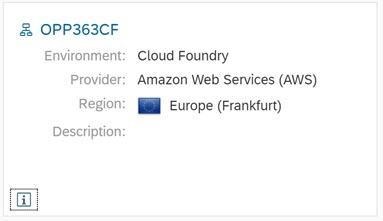

4. The subaccount ID (`dabec0d5-6df7-495d-9c96-f6b25dfd78a4`) is now displayed.
You will need this value when configuring the cloud connector.

    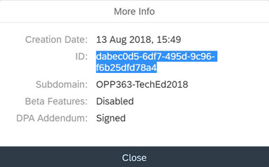

1. Launch SAP Cloud Connector URL <https://localhost:8443> and login with the credentials:

    | Userid | Password |
    |---|---|
    |`Administrator`|`manage`|

    Please ignore the browser warning about an unsafe connection.  If you see this error, click on *Advanced* -> *Proceed to website*.

    Note: You may be asked to re-set your password. If so, please re-set your password and make a not of it.

1. If you see any existing entires in the Subaccount Dashboard table, please delete these as they are left over from a previous exercise

1. Click on the _Add Subaccount_ button in the top right of the screen

    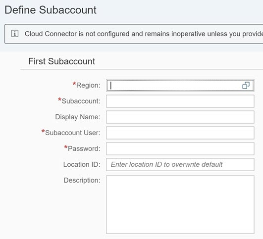

1. Enter the following configuration values:

    | Property | Value | Description
    |---|---|---|
    | Region Host | Select "Europe (Frankfurt)" | `cf.eu10.hana.ondemand.com`
    | Subaccount | Paste in the GUID you copied in step 4 above | During TechEd 2018, this value will be `dabec0d5-6df7-495d-9c96-f6b25dfd78a4`
    | Display Name | `ProductData Connector` |
    | Login Email ID | `<your_login_email>` |
    | Password | `<your_password>` |
    | Location ID |`OPP363-XXX`<br>where XXX is your three digit student number | For the TechEd hands-on sessions, all participants share a single SAP Cloud Platform subaccount. To ensure the SAP Cloud Connector can identify each connection, each student must provide a unique Location ID.<br>You can have multiple SAP Cloud Connectors configured to work with a single sub account as long as each is identified by a unique Location ID
    | Description | `ProductData Connector` |

    ***IMPORTANT***
    The value of Location ID is case sensitive! For the current exercise, ensure that you have entered ***OPP*** in upper case characters, since we will be using exactly this string value elsewhere in the exercise.

    Ignore the fields under the section HTTPS Proxy on the right side, leave them blank


1. Click _Save_.

1. From the Subaccount Dashboard table, select the newly created subaccount by clicking the `>` icon on the far right of the table row.

    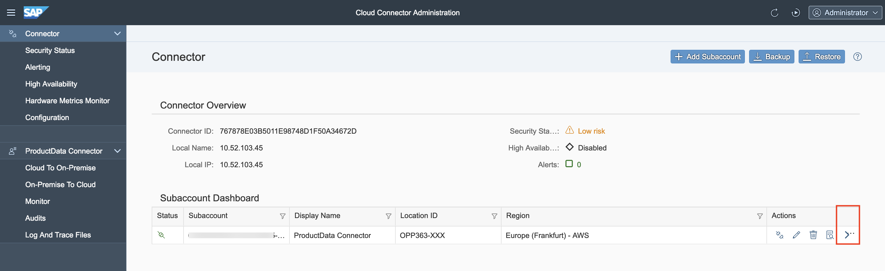

1. Under Tunnel Information, ensure that the status is Connected. If you see an error, check that you have entered your Region, Subaccount and login information correctly.

    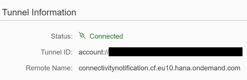

    We have now configured the SAP Cloud Connector running on our local laptop to connect to our SAP Cloud Platform account.  Next, we need to configure the SAP Cloud Connecter to grant access to the resources available from our simulated backend system.

1. In the SAP Cloud Connector UI, click on `Cloud To On-Premise` from the left-hand menu.

1. In the toolbar of the "Mapping Virtual to Internal System" table, click on the `+` icon.

    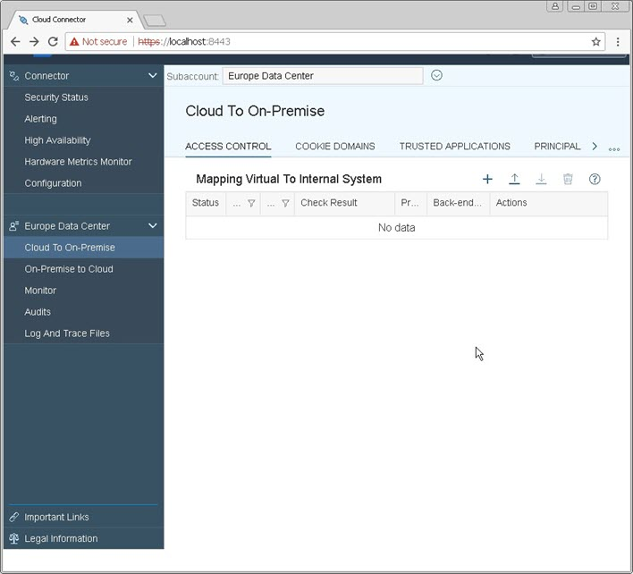

1. Choose Back-end Type as `Non-SAP System` and click _Next_.
1. Choose Protocol as `HTTP` and click on _Next_.
1. For Internal Host, enter:

    - Internal Host: `localhost`
    - Internal Port: `8080`

1.	Click _Next_.
1.	For Virtual Host, enter:

    - Virtual Host: `productbackend.com`
    - Virtual Port: `8080`

1.	Click Next.
1.	Leave Principal Type as `None` and click _Next_.
1. Enter a Description and click _Next_.
1. In the Summary Screen check the `Check Internal Host` check box and click _Finish_.

    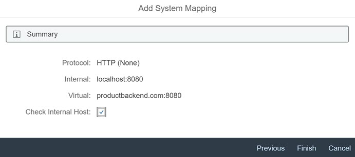

1. The "Check Result" column should now say `Reachable` in Green.

    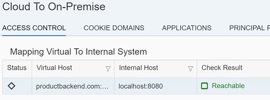

1. Under the **Resources Accessible On productbackend.com:8080** section, click the `+` icon to define which resources will be exposed from this system.
1. Enter `/backend-odata/` under URL Path.
1. Select the option `Path and all Sub paths`.

    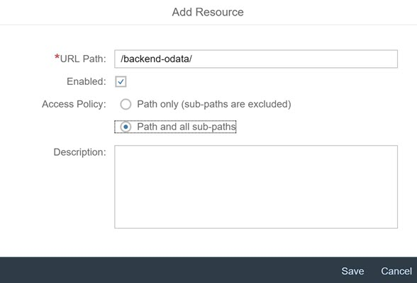

1. Click _Save_.
1. The Status should now be Green.
1. If it is not green, check that the value for URL Path is correct

This completes the configuration of the SAP Cloud Connector.

[Top](#top)

| Back |
|---|
|[Exercise 4 - Order New Items](../Exercise-04-Order-New-Items) |